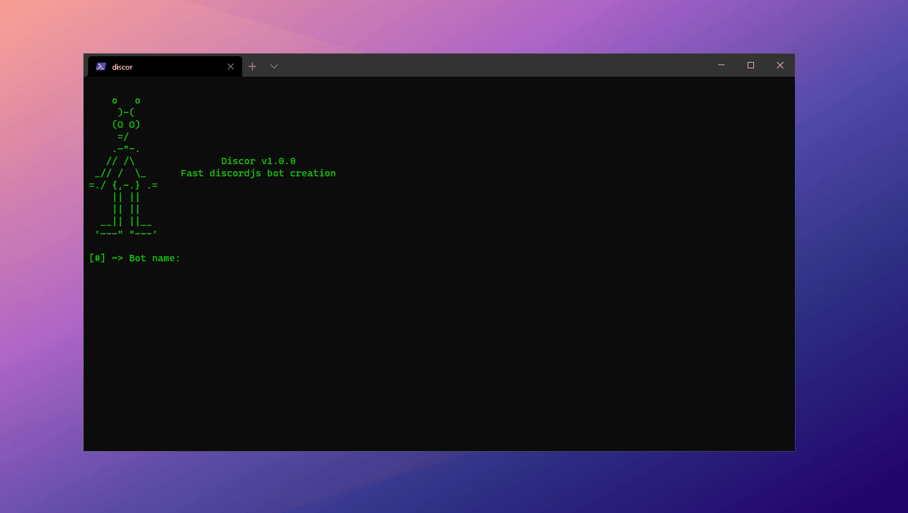

# 🛸 Discor

> Fast discord bots creation.

  

## 🤔 What is this?
🛸 **Discor** is an NodeJS CLI application to automate the process of discord bots creation.

  

## ⚡ Quickstart
1. Download **Discor** with `Code > Download ZIP` button or `git clone https://github.com/oppsec/Discor.git`
2. Create a application on [Discord Developer Portal](https://discord.com/developers/applications)
3. Turn the application in a bot
4. Copy the bot token
5. Execute **Discor**

  

## ⚙️ Setup
1. You need [NodeJS](http://nodejs.org/) installed.
2. Install [DiscordJS](https://discord.js.org/) with `npm i discord.js`

  

## 📚 License
- MIT License.