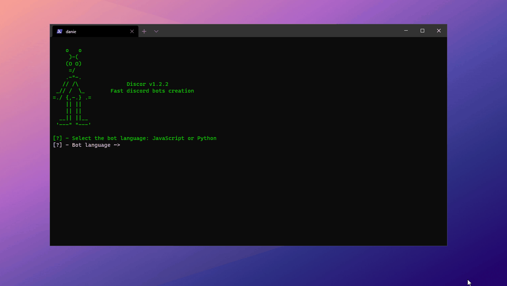

# 🛸 Discor

 

> Fast discord bots creation.

  

## 🤔 What is Discor?
🛸 **Discor** is an NodeJS CLI application to automate the process of discord bots creation.

  

## ⚙️ Set-Up
- Install [NodeJS](http://nodejs.org/) or [Python](https://www.python.org/) on your machine 
- *For NodeJS* - Install the [DiscordJS](https://discord.js.org/) librarie with `npm i discord.js`
- *For Python* - Install the [DiscordPy](https://discordpy.readthedocs.io/) with `pip install -U discord.py`

  

## ⚡ Quickstart
1. Download the .RAR file in Releases page
2. Follow the instructions on the release section
3. Create a application on [Discord Developer Portal](https://discord.com/developers/applications)
4. Transform your application on a bot and copy the token
5. Execute Discor and insert the bot token.

  

## 👀 Preview

  

## 📚 License
- MIT License.
